# Tails on Trails 

Tails on Trails is a website to provide registered users to share information on dog-friendly nature trails in Ireland.

[View the live project here.](https://tailsontrails.herokuapp.com/)

Mock up screenshot will be inserted here.

This site is created as a portfolio project for Code Institute's Software Development course. Please note that the course duration for my group, coding career for women is shortened by 3 months.

## The purpose of this site 

This site is created to share/seek the information about dog-friendly nature trails in Ireland.
There are numerous nature trails and their information widely available online however there are not as many information about the suitability of the walk with man’s best friend.
The information on dog-friendly nature trails is not easy to find at present so here I created a forum to share the information and experience of the nature walk with dogs.
This site is mainly intended for registered users however unregistered guest users can view the summary of the posts. The reason for this is to give unregistered user a chance to preview the service before they make a decision whether or not the site is suited for their needs. 

## User Experience

### USER STORIES

Isseu No. | Title | User story | Acceptance criteria | Implemented
----------|-------|------------|---------------------|-------
#01 | Create Landing page | As a Site owner I can provide clear purpose of the site so that new and returning users know what the web site is about and how to use it | State clear purpose of the site in the page and no confusing elementsfor site visitors | [x]
#02 | Account registration | As a Site User I can register an account so that I can comment and like | Secure and easy account registration page and logout button made available once logged in | [x]
#03 | Create post | As a registered user I can create a post and publish it so that I can share an information to others |  For minimum implementation, admin user can create a post by using admin page. Ideally registered users can create posts pending approval from admin user. | [x]
#04 | Manage post | As a Site Admin I can create, read, update and delete posts so that I can manage forum content | Admin user can manage the status of the posts and comments for the safe use of the site | [x]
#05 | Site pagination | As a Site User I can view a paginates list of posts so that easily select a post to view | Preset number of posts to display in page to avoid too much scrolling. | [x]
#06 | Approve Post | As a Site Admin I can approve or disapprove posts so that I can filter out objectionable comments | Preset the new post to post status and only allow to  display the post with approved status | [x]
#07 | View post list | As a Site user I can view a list of the posts so that I can select | Both registered and non-registered users can view the summary of all approved posts | [x]
#08 | Open a post | As a Site User I can click on a post so that I can read the full content of the post | Only registered users can open an individual post detail and view/create a comment or press Likes  | [x]
#09 | Comment on a post | As a Site User I can leave comments on a post so that I can be involved in the conversation | Only registered user can leave comments and only approved comments can be displayed  | [x]
#10 | View comments | As a Site User / Admin I can view comments on an individual post so that I can read the conversation | Comments displays on a page that only registered users have access to. | [x]
#11 | Approve comments | As a Site Admin I can approve or disapprove comments so that I can filter out objectionable comments | Ensure that new comments are set to False for approval so that Admin user can approve upon review  | [x]
#12 | Like/Unlike | As a Site User I can like or unlike a post so that I can interact with the content | Only registered user has access to the button and they can remove Like by pressing the button again  | [x]
#13 | View Likes | As a Site User / Admin I can view the number of likes on each post so that I can see which is the most popular or viral | Number of the Likes counted correctly  | [x]
#14 | Uploading the image | As a registered site user I would like to include an image/images to my post so that I can make more visual impact on my post | Image file uploaded to Cloudinary and render in the corresponding post and profile  | [x]
#15 | Filter on posts | As a site user, I would like to filter the posts so that I can see only the lists of posts that I am interested in | Not finalised as this is an extra feature to the site | [ ]
#16 | View profile | As a registered site user, I would like to view the post creators profile page so that I can find out more about the author of the post | Ensure that  only registered users can view the profiles  | [x]
#17 | Location on map | As a site user I would like to see the location of the post on the map so that I can find out the exact location if I want to visit there | Not finalised as this is an extra feature to the site | [ ]
#18 | Add email authentication | As a site owner, I would like to send a registration link to user’s email in order for the users to complete the registration so that I can verify user's email is legit | Not finalised as this is an extra feature to the site | [ ]
#19 | Contact page | As a site user I would like to be able to contact the site owner so that I can express my opinion or make queries about the site | Not finalised as this is an extra feature to the site | [ ]
#20 | About the site | As a user I can find the information about the site so that I can quickly familiarize the use of the site | About the site information should be accessible from every page within the site  | [x]
#21 | Site works as intended- testing | As a site owner I can make sure that site works throughout as intended so that I can provide a reliable service to users | Acceptance criteria: Automated testing added and successfully runs in addition to manual testing  | [x]

### STRATEGY

* Focus:
  The focus of this project is to provide a safe information sharing space for dog owners who would like to gain/share the knowledge of dog-friendly nature trails available in Ireland

* Definition:
  Tails on Trails is a forum like web site for the registered member to share the information and experience of the nature trails in Ireland

* Value:
  The registered users can make posts about their information on dog-friendly nature trails. They can also view on other member's posts and communicate by leaving comments and press Likes.

### SCOPE

**Features:**

  **Navigation menu** - The navigation menu is clear and consistent throughout the site to provide the users for easy navigation

  **Landing page** - The landing page has a bfief description of the purpose of the site

  **Forum list** - Provide both registered and unregistered user to view the list of the post summaries 

  **Post detail page** -  The users who are registered and logged in can view the detailed of the post and interact by making a comment or press Like

  **Member Page** - Registered users can see the list of the registered members

  **Profile Page** - Registered users can share their brief information about themselves for other registered user to view

  **Create/Edit post Page** - Registered users can create a post to share thier experience on a nature trail

  **Delete post Page** - Registered users can delete their own post 

  **Admin page** - This page is restricted to the site administrator and is used to approve the posts and comments for the safe use of the site to ensure all the posts and comments appears in the site is not inappropriate.

  **About the site page** – Information on the site provided in this page. Users can find out here which page is accessible for registered members only.

 **Planned Features:**
  * The site should be responsive and user-friendly on all devices.
  * Intuitive and user-friendly navigation
  * Intuitive and user-friendly layout
  * There should be an about page to states which information is accessible for registered and unregistered users
  * The landing page should provide clear purpose of the website for any site vistors
  * Users should be able to easily register/login/logout
  * Only registered user can view the details of the posts and leave comment and press Likes
  * Unregistered users can view the post lists that only provide the summary of the posts
  * Registered users can see the location of the posts

### Structure
  1.	The site visitor will first be presented with landing page where they can read the purpose for this site. They get a choice to register first or view the forum page by pressing the button. 
  2.	In the Forum page both registered and unregistered site visitors can view the list of the posts but only registered users can open the post detail page by clicking on the button. For unregistered users the button to open the post detail page is not visible to them. 
  3.	The Profile page will have image and a brief introduction on the member and their beloved dogs. This page is only available to registered users.
  4.	The create post page is accessible for registred users only. This page can be opened by clicking the Create a Post button in the navigation bar which is only visible for registered user 
  After creating the post, Admin user need to approve it before the post displays in the site.
  Users can edit thier own posts by clinking the Edit link located in their post area which is only visible to the post owners.
  5.	(SuperUsers) Approve posts and comments
  6.	(SuperUsers) Manage users

### SKELETON
  **Wireframe:**
  The mockup for this site was done on Balsamiq Wireframes and can be viewed below
  
  

Landing page - Desktop

      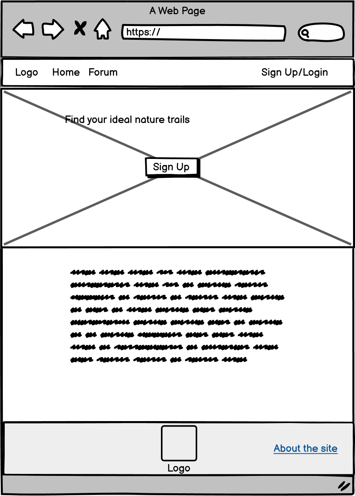
      

  

Landing page - Mobile

      
      

  

Post List page - Desktop

      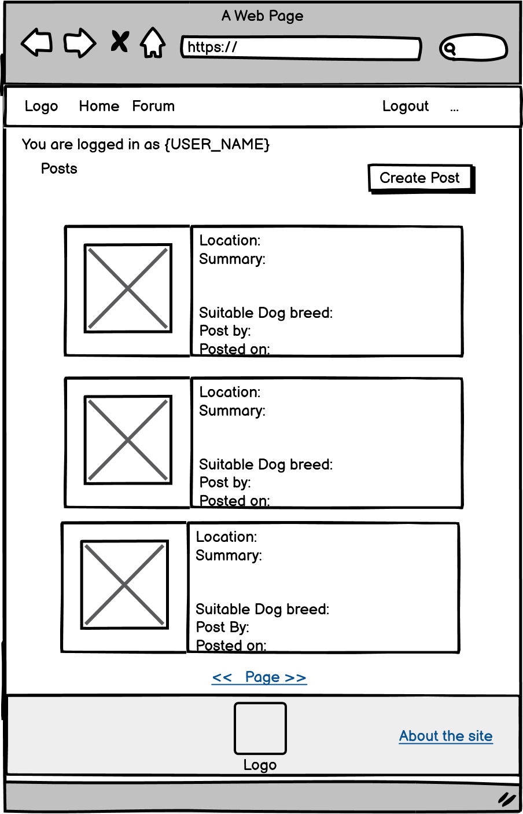
      

  

Post List page - Mobile

      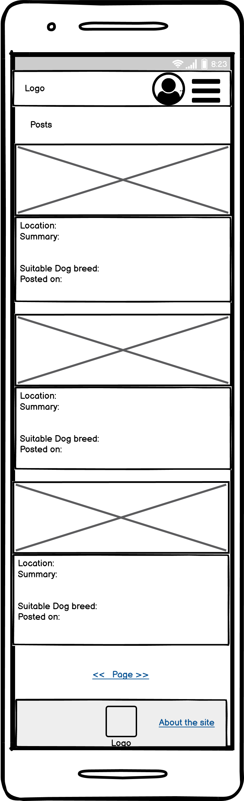
      

  

Post Detail page - Desktop

      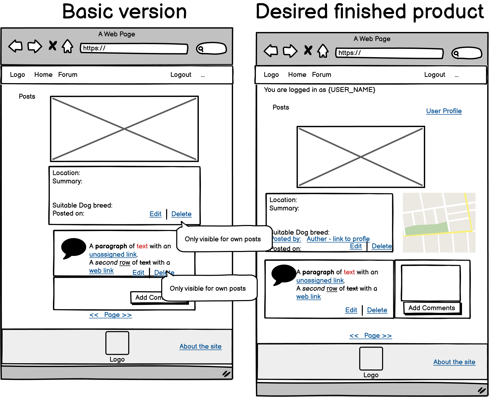
      

  

Post Detail page - Mobile

      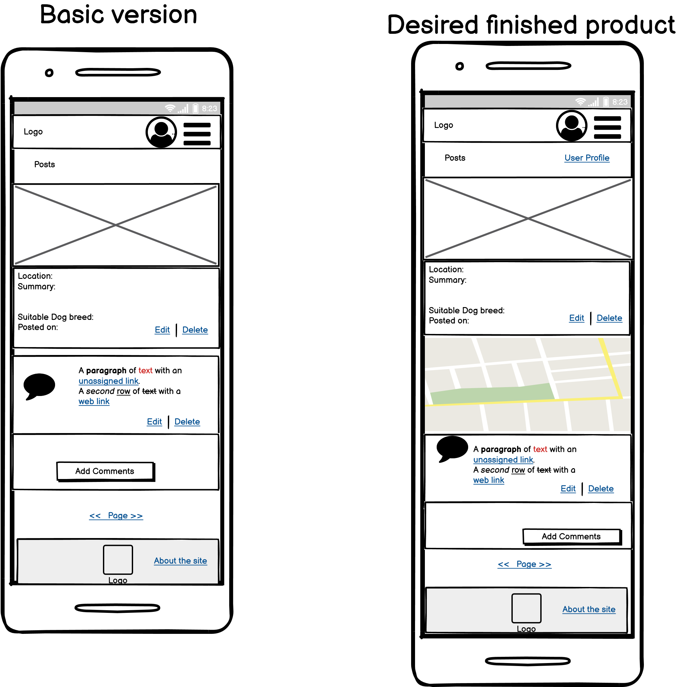
      

  

Create Post page - Desktop

      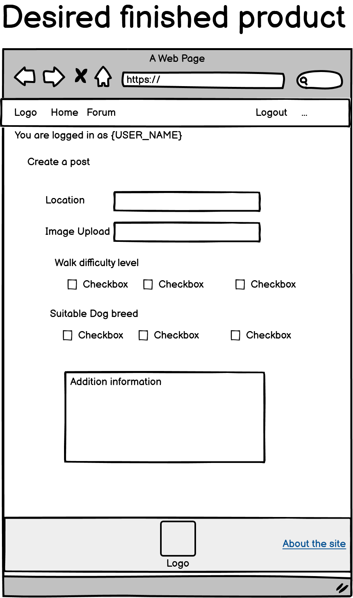
      

  

Create Post page - Mobile

      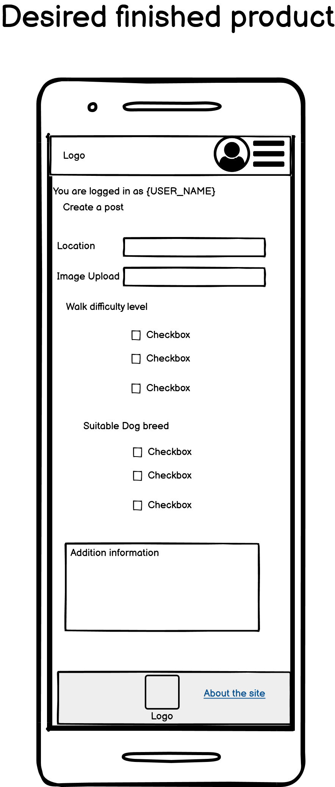
      

  

Login/Register page - Desktop

      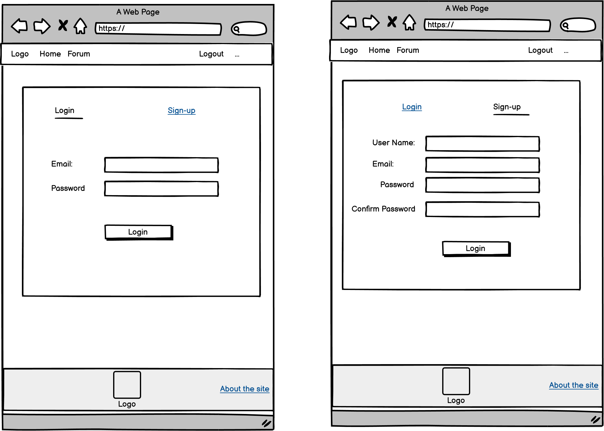
      

  

Login/Register page - Mobile

      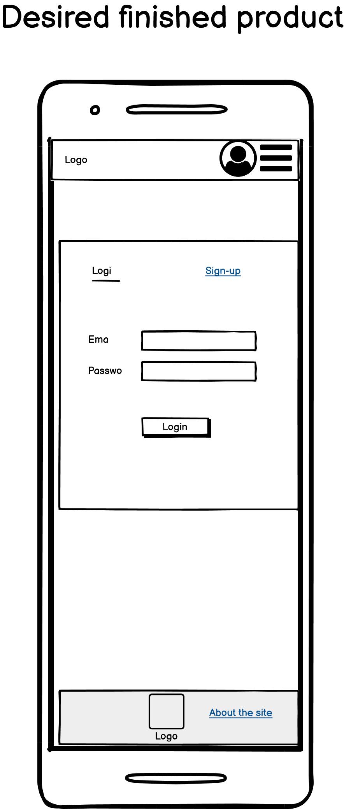
      

  

Profile page - Desktop

      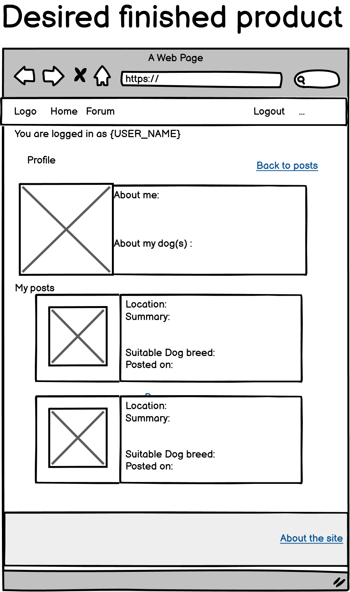
      

  

Profile page - Mobile

      
      

  **Database:**

  Database schema for this site

  

Database schema

      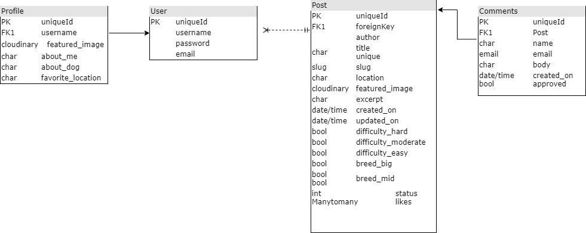
      

## SURFACE
  **Colour Pallette:**
  

  * Color pallette was taken from this site [Inclusive Color Palettes for the Web](https://medium.com/cafe-pixo/inclusive-color-palettes-for-the-web-bbfe8cf2410e)

	
  **Typography:**

  Google font *Roboto* and *Lato* was used for this sie

### Technologies

  * HTML5 
  * CSS3 
  * Python
  * Django 
  * Cloudinary 
  * Bootstrap 
  * FontAwesome 
  * Google Fonts
  * GitPod 
  * GitHub 
  * DevTools 
  * Heroku 
  * WhiteNoise

## Testing

### Automated testing

  [Link to the automated testing document](static/documentation/TESTING.md)

### Manual testing

 In addition to automated testing, each page has been manually tested to ensure that the links and the contents are properly placed and functioning, and all data entry is appropreately handled as expected.

### Errors encountered during development

* Editing post page not displaying:
  The links to edit post page was added in the forum posts and made only visible for the post author, however clicking the link threw 404 error.
  Issue was caused by request user and author not matching, resulting the Http404 raised in the views.py.
  John in Tutor support in Code Institute helped me tackle this issue and suggested few ways to narrow down the cause and approaches to fix it. The successful attempt was to place resuest.user first in the if statement. Here is the problem part of the code, commentd out part shown unsuccessful attempt and final solution which I probably would never have come up by myself in time.

    

Post.author and request.user not matching error

      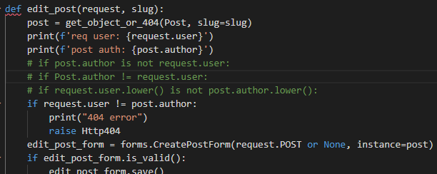
      

* Updating profile page failed to retrieve user instance and update the records.

  I managed to display profile editing page however updating the profile or retrieving the existing profile record was not successful. After contacting the Code Institute’s tutor support, Fatima assisted me to change the function views to different approach which is to use if statement for method==POST and else. This approach successfully retrieved the existing user profile instance and update it as entered in the form.

* Displaying the profile detail page from a link in their own post. 
  
  As the username is used to identify the requested profile page, I was unable to render the correct user profile for a while. Eventually I found this solution from stack overflow.  [stack overflow](https://stackoverflow.com/questions/49645721/how-to-use-username-in-detailview-for-django-2-0/49646148)

* Heroku failing to load static files.

  After the site was build and some tests were carried out in the test environment, I have switched the DATABASE setting back to Heroku's PostgreSQL for deployment. Deployment was successful but the statis files failed to load. I have tried to switch DEBUG status False and True also, DISABLE_COLLECTSTATIC to 1 to 0 or even removed, however no attempt worked to load static files. 

### Known error present:

  Heroku failing to load static files. 

  
###  Validating code 

All the .py files are validated in the PEP8 online validator.

The result screenshot
 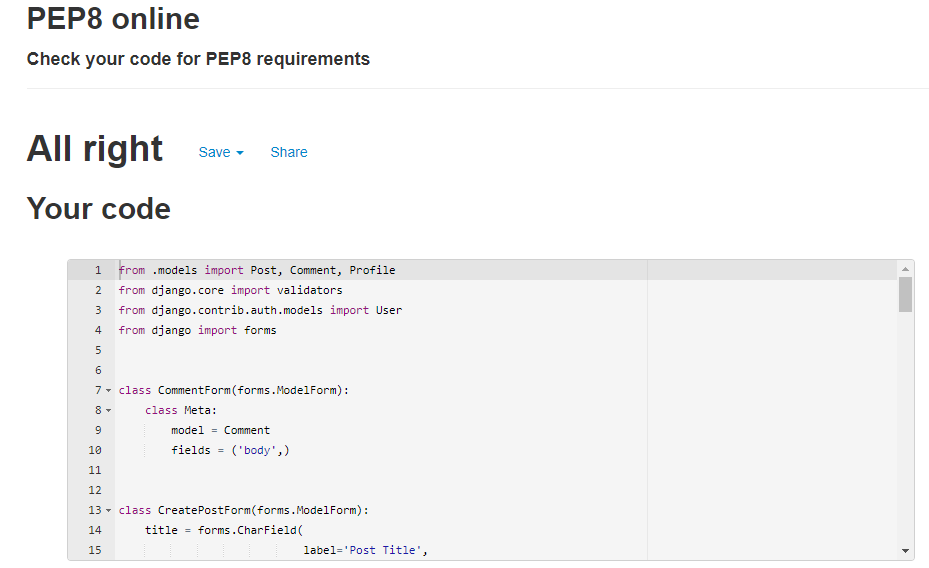
 

At the time of project submission, there were no errors detected in the PEP8 validator.

No errors were returned when passing through the official [W3C validator](https://validator.w3.org/)

No errors were found when passing through the official (Jigsaw) validator [(Jigsaw) validator](https://jigsaw.w3.org/css-validator/)

## Setting up Django environment.

Following additional packages are installed to create this site by using pip3 install
  
  * gunicorn
  * psycopg2
  * dj3-cloudinary-storage
  * django-crispy-forms
  * django-allauth

## Deployment
Here are the deployment procesure I have taken to deploy this project on Heroku

1. In the Heroku dashboard, click new then enter the app name and specipy the region.

2. In Add-on section in the resources tab, search postgres then select Heroku Postgres and submit order from button in the popup window.

3. In the setting tab, click on Reveal Config Vars button then copy the value for DATABASE_URL key.

4. Create env.py directly under the repo directory same lavel as manage.py and make sure the file name is included in .gitignore as this is a setting for local development site in Gitpod
Heroku Config vars need to be set accordingly including DATABASE_URL and SECRET_KEY

5. In setting.py file include followings:

    import os

    import dj_database_url

    if os.path.isfile('env.py'):

        import env

    modify SECRET_KEY line to SECRET_KEY = os.
    environ.get('SECRET_KEY')

    Replace DATABASES as
    DATABASES = {

        'default': dj_database_url.parse(os.environ.get('DATABASE_URL'))
    }

6. In the Gitpod terminal, migrate the change by
python3 manage.py migrate. Check the resource tab in heroku and choose 
Heroku Postgres then ensure the changes are reflected in the database

7. Login to Cloudinary and copy the API Environment variable and paste in env.py and also Config Vars in Heroku.

8. DISABLE_COLLECTSTATIC set to 1 in Config Vars in Heroku as the initial deployment does not contain static files yet.

9. In setting.py configure followings:
 
    * Add 'cloudinary_storage', before 'django.contrib.staticfiles', and 'cloudinary' after it.

    * Set STATICFILES_DIRS, STATICFILES_DIRS, STATIC_ROOT, MEDIA_URL and DEFAULT_FILE_STORAGE so that Django can use the directories appropriately.

    * Set TEMPLATES_DIR just below BASE_DIR and insert TEMPLATES_DIR in TEMPLATES array
    'DIRS': []

    * Set ALLOWED_HOSTS array as 'tailsontrails.herokuapp.com', 'localhost'

10. Create Procfile with the contents 

    web: gunicorn tails_on_trails.wsgi

11. In the deployment tab in Heroku page, connect to GitHub and search for the repository then Connect.

    Click on Deploy Branch

## Credit

* Contents

* Coding
  
  [Django documentation](https://docs.djangoproject.com/en/3.2/)

  [Django Secret Key Generator](https://miniwebtool.com/django-secret-key-generator/) 

  [Solution for Login_required error](https://www.buzzphp.com/posts/login-required-decorator-gives-object-has-no-attribute-user-error)

  Solution for auto-generating slug field  [stack overflow](https://stackoverflow.com/questions/50436658/how-to-auto-generate-slug-from-my-album-model-in-django-2-0-4)

  Solution for displaying profile from post detail page with username  [stack overflow](https://stackoverflow.com/questions/49645721/how-to-use-username-in-detailview-for-django-2-0/49646148)

  Solution for applying login_required to ListView [stack overflow](https://stackoverflow.com/questions/10275164/django-generic-views-using-decorator-login-required)

  [Displaying success meaages in rendered page](https://dot-blog.jp/news/django-messages-frame-work/)

  Django automated testing [Django Testing Tutorial](https://www.youtube.com/watch?v=qwypH3YvMKc&list=PLbpAWbHbi5rMF2j5n6imm0enrSD9eQUaM)

  Udemy [Django tutorial by CODOR](https://www.udemy.com/course/django-3app/learn/lecture/23384214#overview)

  Udemy [Django tutorial by startcode](https://www.udemy.com/course/python-django-web/learn/lecture/23845550)

 Tutor support, John, Fatima and Sean for helping me to trouble-shoot some of the issues I encountered.

* Images 
  
  * [No photo image](https://icon-library.com/icon/no-photo-available-icon-20.html)
  * [Other pictures - pexel.com](https://www.pexels.com/)

  ## Acknowledgment
  I would like to thank my cohort group of coding career for women for sharing all their knowledge and supporting each other. Also a special thanks to our group facilitator Kasia for her endless encouragement and support for us. Her extra effort to get the clarification of the project requirements for us was so valuable.