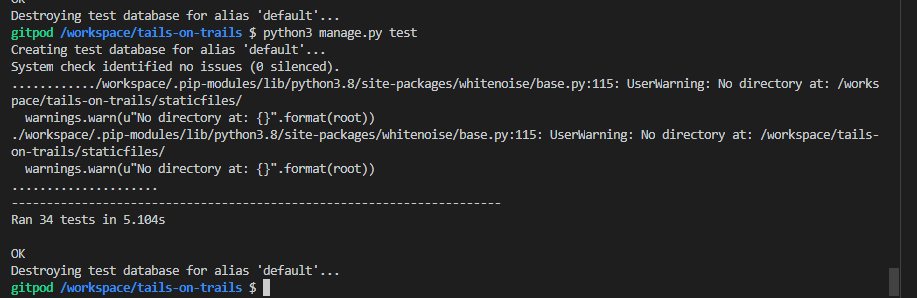
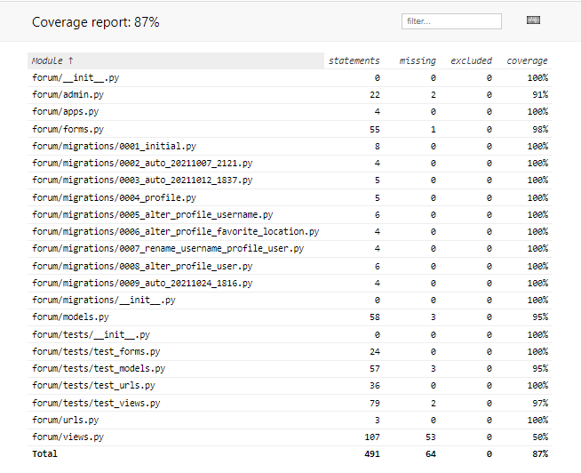
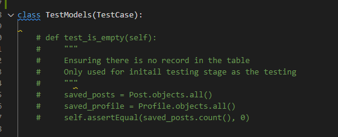
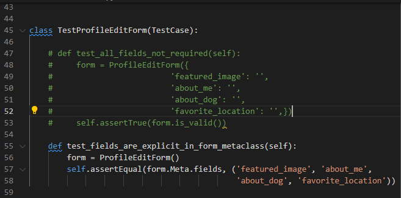

# Testing

## Automated Testing

Django's Unittest is used to test the site to ensure it displays appropriate response and render correct templates. Test files can be found under ‘forum/tests directory.’

Setting up a local testing environment to point to local development environment after deployment of Skelton project
I have taken the deploy ‘empty project first approach’ as it was encouraged in Code Institute's Blog’s walkthrough. The main reason for this is to avoid a last minute deployment issue. However, testing in  a deployed project threw errors when connecting database. In order to resolve this to accommodate testing I needed a setup of the testing environment for Django to refer to the local Sqlite3 database. The procedure for this was kindly shared by a cohort student group member, Elaine. Here are the steps taken to enable testing in the development environment.

### Setting up a local testing environment to point to local development environment after deployment of Skelton project

I have taken the 'deploy empty project first approach' as it was encouraged in Code Institute's Blog’s walkthrough. The main reason for this is to avoid a last minute deployment issue. However, testing in  a deployed project threw errors when connecting database. In order to resolve this to accommodate testing I needed a setup of the testing environment for Django to refer to the local Sqlite3 database. The procedure for this was kindly shared by a cohort student group member, Elaine. Here are the steps taken to enable testing in the development environment.

1. Following lines were added in setting.py and env.py

    **In setting.py**

        if development:
            DATABASES = {
                'default': {
                    'ENGINE': 'django.db.backends.sqlite3',
                    'NAME': BASE_DIR / 'db.sqlite3',
                }
            }
        else:
            DATABASES = {
                'default': dj_database_url.parse(os.environ.get('DATABASE_URL'))
            }

            
            
        development = os.environ.get('DEVELOPMENT', False)

        if development:
            ALLOWED_HOSTS = ['localhost']
        else:
            ALLOWED_HOSTS = ['blog.herokuapp.com']
            
    **In env.py**

    
      os.environ["DEVELOPMENT"] = "True"

2. After setting up the development setting, run migrate in command line as follows: python3 manage.py migrate

### Automated Testing

Django's Unittest is used to test the site to ensure the site displays appropriate response and render correct templates.
Test files can be found under forum/tests directory.

Result

      
      

**Coverage**

Here is the coverage screenshot for the test

Coverage html result

      
      

**Incomplete test**
 Some of the automated tests are incomplete due to lack of time and manual tests were carried out instead.

 Here are some of the incompete testing that was removed before submission.

  

test_models

      
      

  

test_forms

      
      

### User Story testing

Issue No. | Title | Acceptance criteria | Manual test carried out
----------|-------|---------------------|-------------------------
#01 | Create Landing page | State clear purpose in Lading page | Ensure that landing page displayed appropriately in all screen sizes and all information present without any confusing element in the page to all site visitors
#02 | Account registration | Secure, easy account registration, log-in and log-out | Registration, log-in and log-out process is tested manually several times to ensure that any registration process doesn't cause confusion or issues.
#03|  Create post | The registered users can create posts pending approval from admin user | Ensure the creating, editing, viewing and deleting post is appropriately processed and that the procedures are straight forward. Restrict the editing and deleting post process to user's own entry only except for superusers
#04 | Manage post | Admin user can manage the status of the posts and comments | Admin can review all posts in Django's admin page and easily manipulate the status to control the view of the post within the site
#05 | Site pagination | Pre-set number of posts | Posts and user profiles are created for testing purpose to ensure pagination works appropriately
#06 | Approve Post | Pre-set the new post to  status 'post' | Using Admin page to change the status of posts and ensure the approval reflect on the website view
#07 | View post list | All site visitor users can view the post list | Ensuring the list of the posts displays appropriately on the page and ensure that list doesn't include the post that are not approved by superuser 
#08 | Open a post | Only registered users can open an individual post detail and view/create a comment or press Likes | Tested to ensure that the post detail page is only available to registered and logged in users.Also the link to the post opens the post selected was manually tested each time the entry is created
#09 | Comment on a post | Only registered users can leave comments and only approved comments can be displayed | Several user accounts used to ensure the comment posted are displayed appropriately after approved by superuser. Each time comment was created, feedback message in the comment box is checked to ensure that user gets the feedback for their action
#10 | View comments | Comments are displayed on a page that only registered users have access to | Manual inspection to ensure each approved comments were displayed in the related post detail page once it was approved
#11 | Approve comments | Ensure that new comments are set to False for approval so that Admin user can approve upon review | Admin page is used to control the comment status and this process is manually tested to ensure that status is set to False initially and those comments are not displayed in the site
#12 | Like/Unlike | Only registered users have access to the button and they can remove a like by pressing the button again | Tested to ensure that Like/Unlike button reflected user's click to add or remove appropriately
#13 | View Likes | Number of the Likes counted correctly | Manually tested the number of likes increments every time the Like is added
#14 | Uploading the image | Image file uploaded to Cloudinary and render in the corresponding post and profile | Visual inspections were carried out each time image was uploaded and checked that corresponding image is displayed appropriately in the page
#15 | Filter on posts | Not implemented | No test carried out
#16 | View profile | Ensure that only registered users can view the profiles | Manually tested to ensure that empty user profile was created in the database when user is registered and their profile is added  in the member page.
#17 | map | Not implemented | No test carried out
#18 | email authentication | Not implemented | No test carried out
#19 | Contact page | Not implemented | No test carried out
#20 | About the site | 'About the site' information should be accessible from every page within the site | Ensure that the About the site link is available in every page and information in the page is clear to any site visitor
#21 | Testing | Testing to ensure the site works as intended | Manual test and some automated testing was carried out

### Manual testing on each page.

In addition to automated testing and testing user stories manually, each page has been manually tested to ensure that the links and the contents are properly placed and functioning, and that all data entry is appropriately handled as expected. Page access is also tested for the restricted pages.

Every link within the page has been checked to ensure that it displays the page appropriately.
Visual inspections carried out to ensure that restricted page links or buttons are not visible on the page.
  
#### Landing page

**Users who have not logged in**  
 They are resented with Login and Register buttons to the right of the navigation bar. Visual inspections are carried out to ensure that the buttons are displaying appropriately to logged in users and users who are not logged in a number of times.

**Registered and logged in users**

 Upon the opening page they can click on Login to open the Login page. After successful login, manual testing was taken place to ensure that the message of successful login is displayed and Register and Login buttons are replaced to three buttons which are, Create a Post, Username and Logout. Visual inspection to ensure there is a Members link beside the Forum menu on the left added to the menu.
 Each button and link is manually tested to ensure it opens the appropriate page 

#### Post List page

**For site visitor who has not logged in**

Visual inspections are carried out so that no links to the post detail page or edit post are present in each post in the list. 
Ensure that all the posts displayed in the page are approved posts and information displayed is correct as created post
Pagination is tested by adding a numbers of posts to ensure the posts displayed in one page is 6 and rest will be displayed by previous button at the end of the page 
**For registered and logged in users**

Ensure the post list is only displaying approved posts with correct information entered by the user.
Pagination is working in the same way as users who are not logged in.
View button is present in each post and links will open the selected post detail page.
For a current logged in user’s own post, an Edit button is present in the post panel and selecting it will open the ‘Edit’ post page with selected post entry retrieved.

#### Post Detail page

**For a site visitor who has not logged in**

Access is attempted by copying the individual post address to ensure that the page is not displayed for the site visitors who are not logged in.

**For registered and logged in users**

Visually inspected all post entries are correctly retrieved and displayed in the post.
View Profile button and  open the selected users profile page.
Ensure that the clicking like button increments the number only once and selecting it again removes the count by one.
When submitting a comment, the feedback message displays in the comment panel so that the user is notified about the status of their comment.
Once approved by superuser, the number of the comment increments by one and the comment displays in the Comments panel

#### Create a Post page

**For site visitor who has not logged in**

Access is attempted by copying the page address to ensure that the page is not displayed for the site visitors who are not logged in.

**For registered and logged in users**

Entering an existing title field will return the error message to prompt the user to enter another title.
Attempting to create a post with a blank required field returns error message.
File upload is successful without any issue
When ‘Create button’ is pressed and entry is successful, the page will redirect to ‘post list page’ with a message to notify the user about the status of the post

#### Edit post page

**For site visitor who has not logged in**
Access is attempted by copying the page address to ensure that the page is not displayed for the site visitors who are not logged in. 404 page returned as expected.

**For registered and logged in users** 

Displayed edit post page has corresponding selected post entries in each field.
Removing the required fields does not let a user to update the post.
Error message to inform users if a required field is left blank on an attempt to update is not showing at the moment.
Upon successful update,  the page redirects to the post list page with a message to inform the users the update was successful.
Delete this post link opens Delete post page

#### Delete Post page

**For site visitor who has not logged in**

Access is attempted by copying the page address to ensure that the page is not displayed for the site visitors who are not logged in. 404 page returned as expected.
For registered and logged in users
Cancel and go back to post link opens the post list
Pressing Confirm Delete button actually deletes the selected post and associated comments then returns post list page with message to notify the user the post is deleted
Members Page

**For site visitor who has not logged in**

Access is attempted by copying the page address to ensure that the page is not displayed for the site visitors who are not logged in.
For registered and logged in users
Page displays with each member in a panel with their image, name and button to open their individual profile page.
Button to open individual profile page opens the profile of the selected member
Pagination is in place and working as expected which is 8 panels on one page.
View profile page
For site visitor who has not logged in
Access is attempted by copying the page address to ensure that the page is not displayed for the site visitors who are not logged in.
For registered and logged in users
Selected user’s profile page displays 
Back to profile list link opens Member page
Profile Edit page
For site visitor who has not logged in
Access is attempted by copying the page address to ensure that the page is not displayed for the site visitors who are not logged in.
For registered and logged in users
On pressing their username in the navigation bar, their own profile page opens for editing.
Upload the image works without any issues
As all the fields are optional there is no error message present
Successful update will redirect to Post list page with a notification message 
About the Site page
Page displays for any site visitors and information provided is clear

#### Register page

Tested all validation works without any issues
Ensure that an existing username cannot be registered and returns the error.
Password validations are in place
Upon successful register, the user is redirected to landing page with a notification for their login

#### Login page

Various usernames is used for login attempt and ensure the login process meets the standard
Upon successful login, the user is redirected to landing page with a notification for their login

#### Logout page
Ensure logout will redirect to the landing page with a notification for their logout and restricted pages cannot be accessed.

[Link Checker](https://validator.w3.org/checklink) was used to ensure that there is no broken link within the site

  [<<< Back to README](../../README.md)